# 🛡️ Researching and Implementing a Unified Endpoint Protection Platform

## 👥 Contributors
| MSSV | Contributor | Full Name |
|:--------|:-------------|:-----------------------|
| 21522312 | luongpd2313 | Phùng Đức Lương |
| 21522620 | nt1208 | Hồ Ngọc Thiện |

---

## 📌 Overview
This project implements a **Next-Generation Endpoint Protection Platform (NG-EPP)** using open-source tools.

The system integrates multiple security layers into a unified platform:
- SIEM & EDR (Wazuh)
- Antivirus (ClamAV)
- Firewall (iptables)
- Device Control (USBGuard)
- Vulnerability Management
- AI-powered Threat Hunting (RAG)

The goal is to simulate a **real-world SOC environment**, where attacks are detected, analyzed, and responded to in real time. Below is the Workflow of EPP:

  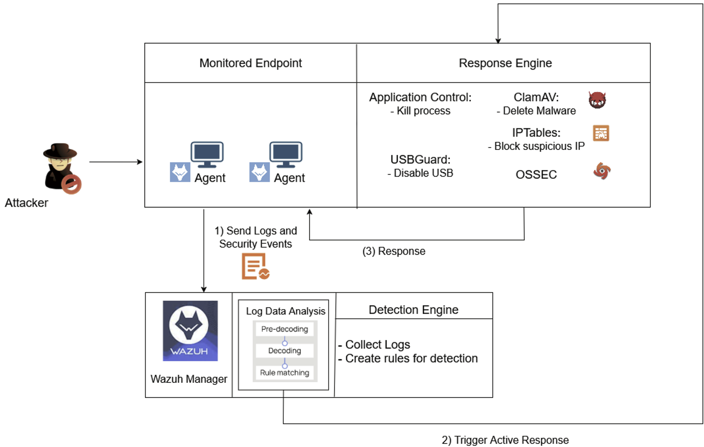 
  <em>Figure 3.1: Workflow of EPP</em>

---

## 🧱 Core Components

- **Wazuh**: SIEM + EDR (log collection, detection, response)
- **ClamAV**: Malware detection
- **iptables**: Network-level protection
- **USBGuard**: Device control
- **MongoDB + Flask**: Data processing for vulnerability module
- **AI (RAG + LLM)**:
  - Log analysis
  - Threat explanation
  - Remediation suggestions

---
# 🚨 Attack Scenarios & Demonstration

---

## 🔴 Scenario 1: Reverse Shell Detection & Response

### 🧪 Attack
A malicious Python script simulating a **reverse shell** is executed on the endpoint.  
The script initiates an outbound connection to the attacker's machine, allowing remote command execution and persistent access.

---

### 🔍 Detection
- The `lsof-monitor` service detects new outbound network connections.
- Logs are forwarded by **Wazuh Agent** to the **Wazuh Manager**.
- Wazuh analyzes:
  - Destination IP address
  - Process information (PID, command line, user)
- The connection is compared against a **blacklist of suspicious IPs**.
- An alert is generated when a match or abnormal behavior is detected.

---

### ⚡ Response
Once the alert is triggered, **Active Response** is executed automatically:

- Analyze the suspicious process (PID, command line, user)
- Check if the process originated from a USB device  
  → If yes, block the device using USB control
- Terminate the reverse shell process
- Delete the malicious file from the system
- Isolate the endpoint from the network for further investigation

---

### 🖼️ Demo: 
[Watch Full Demo For Scen1](https://drive.google.com/file/d/1HJznsLTW11QqCWwRigrPFWWUI_gj3wQs/view?usp=sharing)

---

## 🔴 Scenario 2: Lateral Movement via SSH Agent Hijacking

  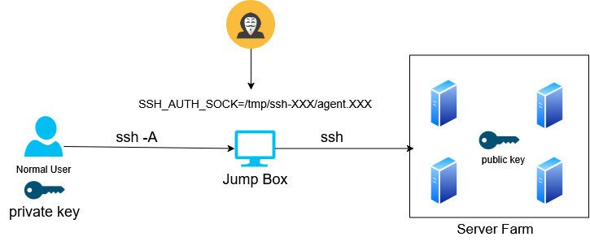 
  <em>Figure 4.6: SSH HIJACKING attack model</em>

### 🧪 Attack
This scenario simulates **SSH Agent Hijacking**, where an attacker abuses **SSH Agent Forwarding (`ssh -A`)** to move laterally across the network.

In a typical workflow:
- A legitimate user connects from their local machine → Jump Box → internal servers (Server Farm)
- Authentication is handled via **SSH Agent Forwarding**, without re-entering credentials

However, this introduces a security risk:
- The forwarded agent is exposed via the `SSH_AUTH_SOCK` environment variable
- If the attacker compromises the Jump Box, they can:
  - Access `SSH_AUTH_SOCK`
  - Reuse the victim’s SSH agent
  - Authenticate to internal servers **without the private key**

---

### 🖥️ Environment Setup

| Machine | IP Address | User |
|--------|-----------|------|
| Jump Box | 192.168.49.140 | jumpbox |
| User Machine | 192.168.49.138 | nt1208 |
| Server Farm | 172.19.192.36 | server |

---

### 🔍 Detection
- Wazuh monitors SSH activities and session behavior
- Suspicious indicators:
  - SSH sessions initiated without normal authentication flow
  - Abuse of `SSH_AUTH_SOCK` environment variable
  - Unusual access pattern from Jump Box to internal servers
- Logs are analyzed to detect abnormal session reuse

---

### ⚡ Response
When malicious SSH usage is detected, **Active Response** is triggered:

- Terminate the active SSH session to the Server Farm
- Disable or lock the compromised `jumpbox` user
- Prevent further lateral movement
- Generate alert for SOC investigation

---

### 🖼️ Demo: 
[Watch Full Demo For Scen2](https://drive.google.com/file/d/1Tfn4od8djykwGdD7UtQqqaeHDyJAMHyg/view?usp=sharing)

---

## 🔴 Scenario 3: Command & Control Server Communication

### 🧪 Attack
In this scenario, the objective is to evaluate the system's ability to automatically detect and respond when an attack using a Command & Control (C2) Server occurs.

  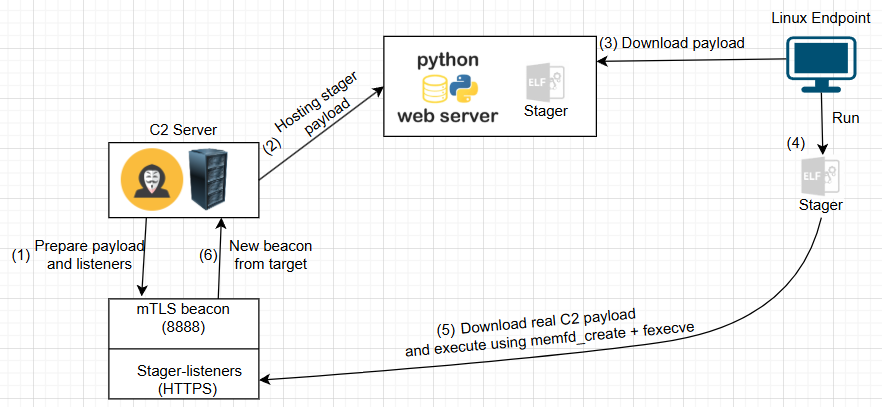 
  <em>Figure 4.11: Command & Control Server attack model</em>

Scenario description: The attack scenario begins when the Command & Control (C2) server is set up to listen for connections from a beacon via the mTLS protocol, while simultaneously providing an ELF payload via HTTPS. On the victim's machine, somehow possibly through phishing (the group uses a basic method of hosting the payload on a Python server for the victim to download), this payload is downloaded and executed - this malware uses libcurl to download the payload from the C2 into memory, writes it to a hidden area via the memfd_create syscall, and then executes it directly using fexecve without writing to the disk, completely evading traditional file-based detection techniques.

---

### 🔍 Detection
However, thanks to Wazuh's monitoring mechanism integrated with Auditd, the behavior of using memfd_create (syscall 319) and fexecve (syscall 322) is recorded and mapped to high severity rules (100010, 100011). Combined with rule 100013, if the process subsequently maintains periodic beaconing connections back to the C2, this behavior will also be detected.

---

### ⚡ Response
**Active Response** is immediately triggered:
- The process is snapshotted, stopped, and then killed
- The executable file (if it exists) is isolated
- The source IP (Endpoint machine) is blocked via iptables to prevent the attacker from continuing remote control or downloading further payloads.

---

### 🖼️ Demo: 
[Watch Full Demo For Scen3](https://drive.google.com/file/d/1nh5KuTLoe2ouc6RC_bCVIQhWCT6uhoM_/view?usp=sharing)

---

## 🛡️ Vulnerability Management Architecture

### 1️⃣ Architecture Overview
The overall architecture of the Vulnerability Management module in the NG-EPP platform is designed to assist administrators in collecting, organizing, and visualizing vulnerability data (CVE) and insecure configurations (SCA). The system simplifies the risk assessment process and provides automated remediation suggestions via augmented AI, thereby optimizing operational performance and enhancing the organization's security response capabilities.

  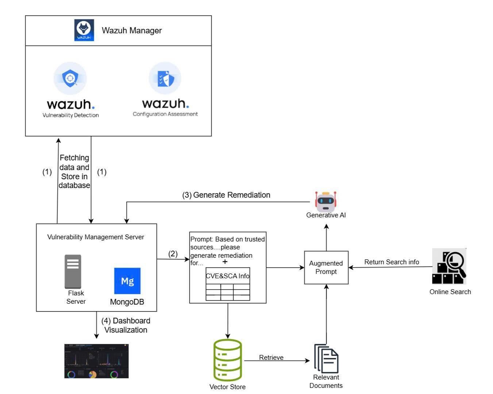 
  <em>Figure 3.5: Overall Architecture of Vulnerability Management</em>

## 🟢 Scenario 4: Vulnerability Management Analysis and Visualization

After deploying the components described in the architecture above, an intuitive dashboard displays the results as shown in Figure 4.16:

  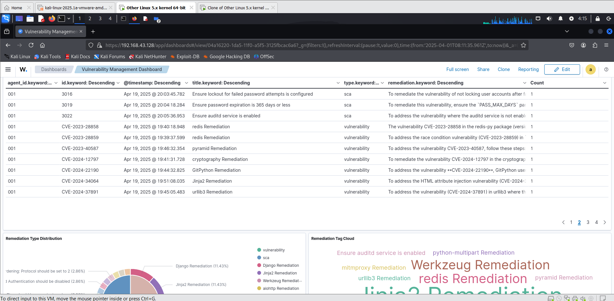 
  <em>Figure 4.16: Remediation results displayed on the Dashboard</em>

Essentially, the `Remediation Table` provides an overview of security issues detected on the system, including software vulnerabilities and insecure configurations. Each row represents a detection event, accompanied by time information, vulnerability type (sca or vulnerability), a brief descriptive title, and corresponding remediation instructions. This table helps administrators easily track, categorize, and prioritize security risks systematically and efficiently.

An example of a remediation for `CVE-2024-53981`, a vulnerability in the `python-multipart` package version `0.0.9`, is as follows:

**Remediation:** > To remediate CVE-2024-53981, upgrade the `python-multipart` package to version `0.0.18` or later, which includes a fix for the excessive logging and potential DoS vulnerability caused by malformed form data. This update ensures that line breaks before the first boundary and trailing bytes after the last boundary are handled more efficiently, preventing attackers from exploiting this behavior to consume excessive CPU resources or stall application threads. Affected applications, especially ASGI-based ones, should prioritize this update to avoid denial-of-service risks. For more details, refer to the trusted sources like: [NVD entry](https://nvd.nist.gov/vuln/detail/CVE-2024-53981) or [GitHub Advisory](https://github.com/advisories/GHSA-59g5-xgcq-4qw3).

By utilizing RAG techniques and online search, this remediation has been improved and is more accurate compared to previous methods that solely relied on static knowledge from prior GenAI models.

### 🖼️ Demo: 
[Watch Full Demo For Scen4](https://drive.google.com/file/d/16qPcd8GpmJrimuaFOSDkuceBOTdjHt8Z/view?usp=sharing)

---

## 🛡️ Threat Hunting and Investigation Architecture

### 1️⃣ Architecture Overview
**Threat Hunting and Investigation** are crucial elements in enhancing endpoint security, combining proactive detection and deep analysis to counter complex cyber threats. The systems design utilizes endpoint log data combined with artificial intelligence (AI), which processes security information at high speed and detects anomalies that humans might miss, thereby reducing the burden on security teams.

The system encompasses **Data Collection** to gather and store logs, **Threat Hunting** using AI to track hidden threats like Advanced Persistent Threats (APTs), and **Investigation** to analyze digital evidence to reconstruct attack chains and support forensics. This integration creates an intelligent feedback loop, where data from Threat Hunting refines detection rules, while Investigation provides information to improve defenses, offering superior adaptability to evolving challenges. With advanced technology, these two elements shape a sustainable and effective security foundation for the future.

  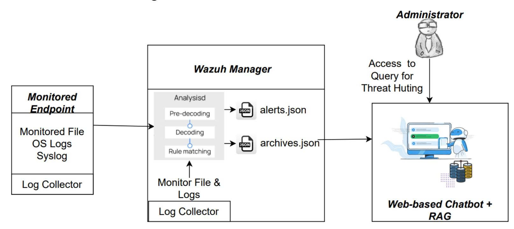 
  <em>Figure 3.6: Overall Architecture of Threat Hunting</em>

### 2️⃣ Operational Flow
Regarding the implementation method, we will write a script to launch a **Web-based Chatbot** service that reads logs from Wazuh archives. Wazuh stores logs in two main places: `alert.json` (events that match predefined rules) and `archives.json` (all events, regardless of whether a rule was triggered, including those in `alert.json`). We will focus more on the latter.

At this point, we employ **RAG (Retrieval-Augmented Generation)** techniques to encode data from `archives.json` and store it in a vector store. The purpose is to create a knowledge base of Wazuh logs for the AI model to reference, enabling it to suggest related threats found in the logs when queried by the user. The responses provided by the AI model can be used as evidentiary support for deeper investigations later on.

---

## 🟢 Scenario 5: Threat Hunting and Investigation Demonstration

With the architecture and components established, launching the program reveals the Chatbot interface:

  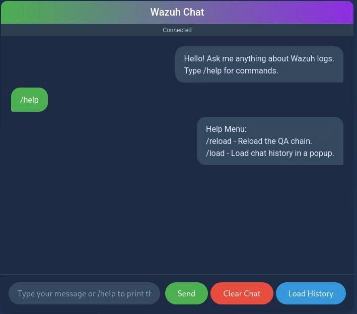 
  <em>Figure 4.17: Web Interface of the Chatbot</em>

Below is the interface displaying the daily `archives.json` logs from Wazuh. We have a scheduled script that runs daily at 3:00 AM, pushing the previous day's logs into this knowledge base. This ensures that vectorized data is always available for retrieval by the Generative AI, allowing it to provide relevant answers about potential threats to administrators based on the extracted context. This interface also serves as the foundation for the AI to retrieve documents from the CIS Benchmark to offer remediation steps for insecure configurations (SCA), which the Vulnerability Management module leverages.

  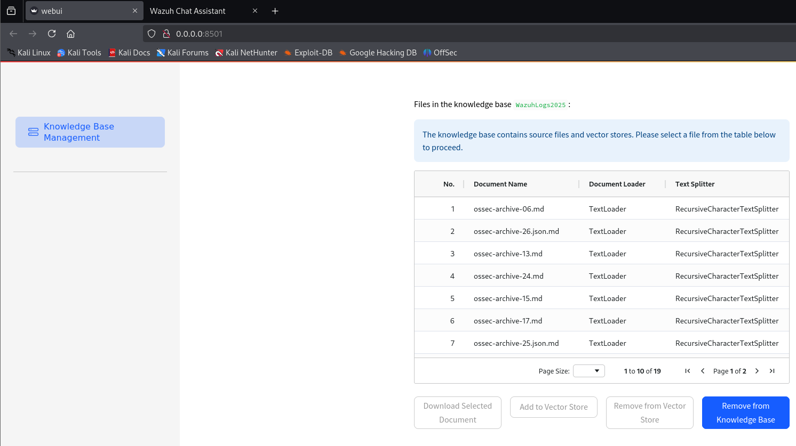 
  <em>Figure 4.18: RAG Interface Storing Archive Logs</em>

At this stage, the chatbot is ready, and we can inquire about common threats. For example, regarding an attempt to **Brute-force** the 'admin' user with 5 consecutive failed logins within 60 seconds:

  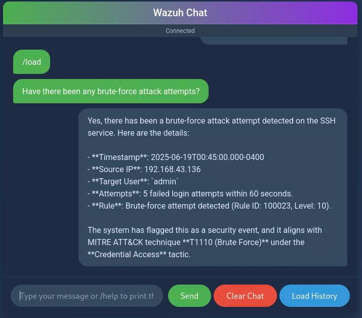 
  <em>Figure 4.19: Result when asking about Brute-force threat</em>

Another example involves the **abuse of `sudo` privileges**, such as detecting a rootkit or executing fileless malware with `sudo` rights.

  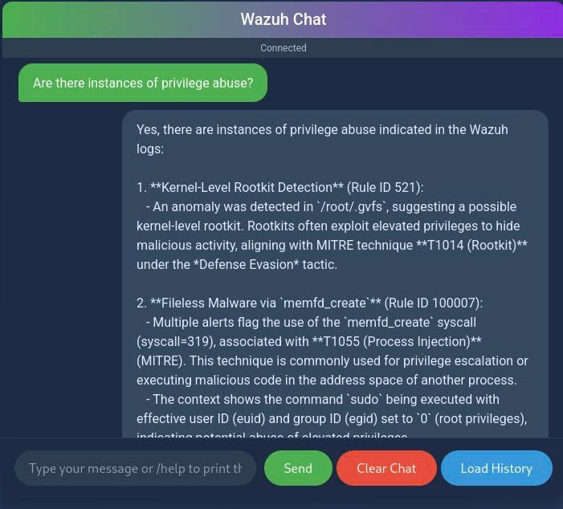 
  <em>Figure 4.20: Result when asking about Sudo Abuse threat (Part 1)</em>

  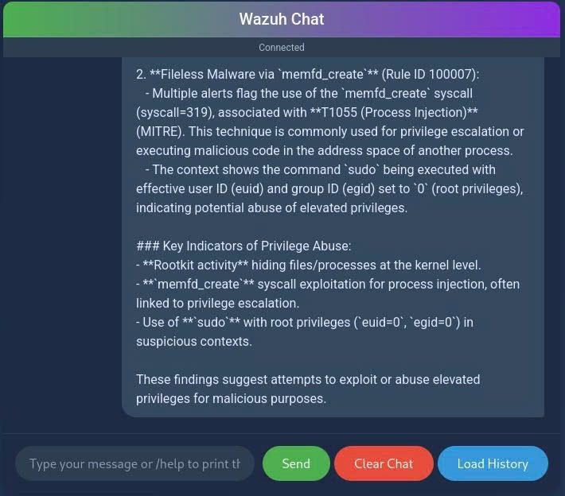 
  <em>Figure 4.20: Result when asking about Sudo Abuse threat (Part 2)</em>

We can also ask the Chatbot to **summarize** the logs concerning significant threats:

  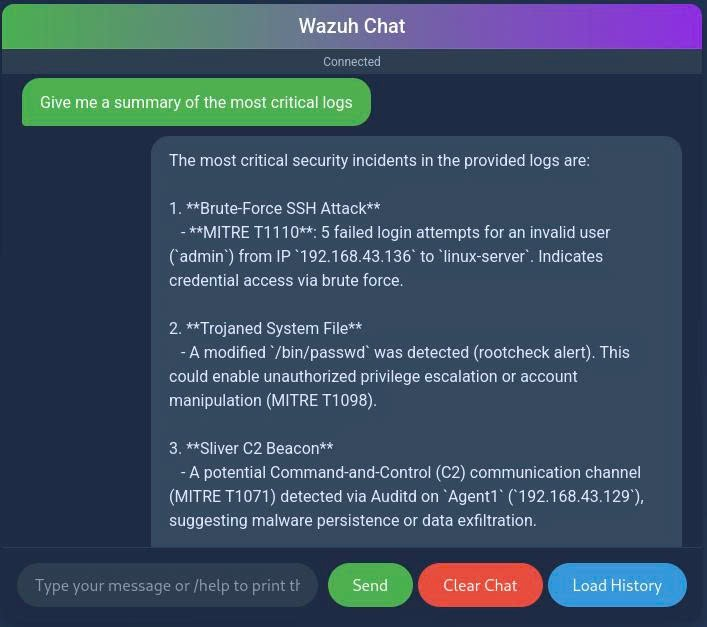 
  <em>Figure 4.21: Result when asking to summarize logs (Part 1)</em>

  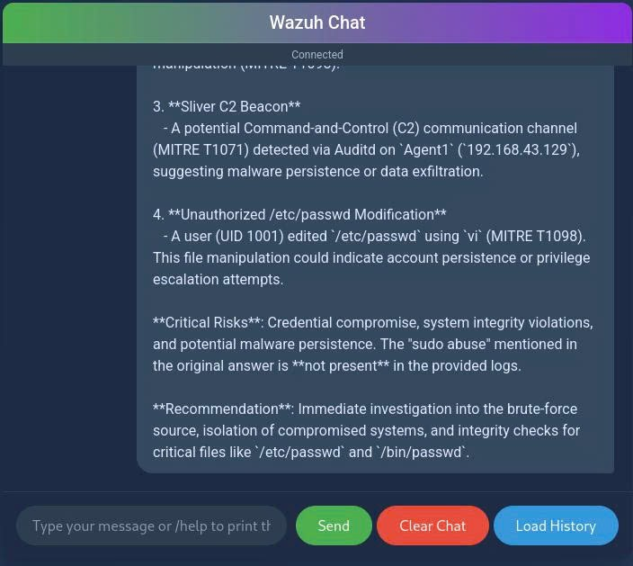 
  <em>Figure 4.21: Result when asking to summarize logs (Part 2)</em>

---

### 🖼️ Demo: 
[Watch Full Demo For Scen5](https://drive.google.com/file/d/13HbCKVqZSPvJxhvAupY3BKZdcJILJLON/view?usp=drive_link)

---

### Conclusion
With the above results, it can be affirmed that Threat Hunting plays a vital role in elevating security monitoring. It proactively detects threats that bypass traditional detection rules, thereby narrowing the window for attackers to exploit the system. 

The integration of Artificial Intelligence (AI) has revolutionized this process by automating the analysis of large-scale data, identifying subtle anomalies, and prioritizing potential risks. This accelerates response times and effectively counters malicious activities. This approach not only enhances the efficacy of endpoint protection but also pioneers new strategies to detect previously undefined threats. Empowered by cutting-edge technologies, Threat Hunting promises to shape the future of cybersecurity, providing a robust foundation for next-generation security systems.
