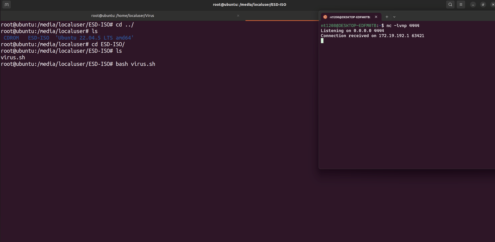
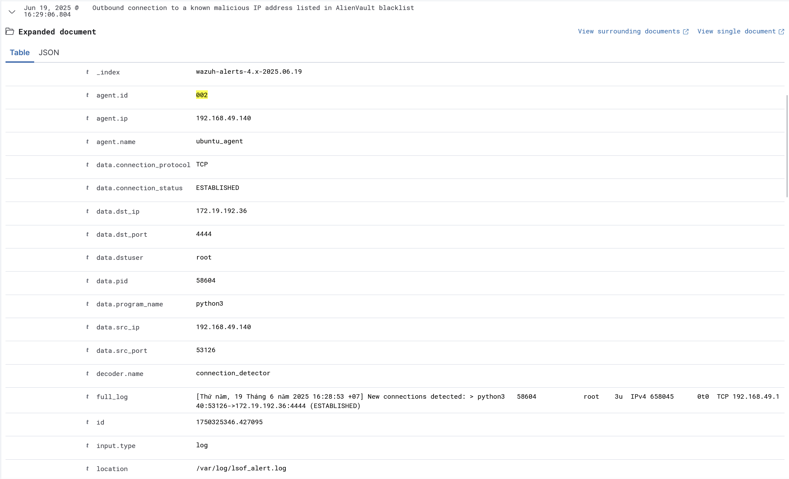
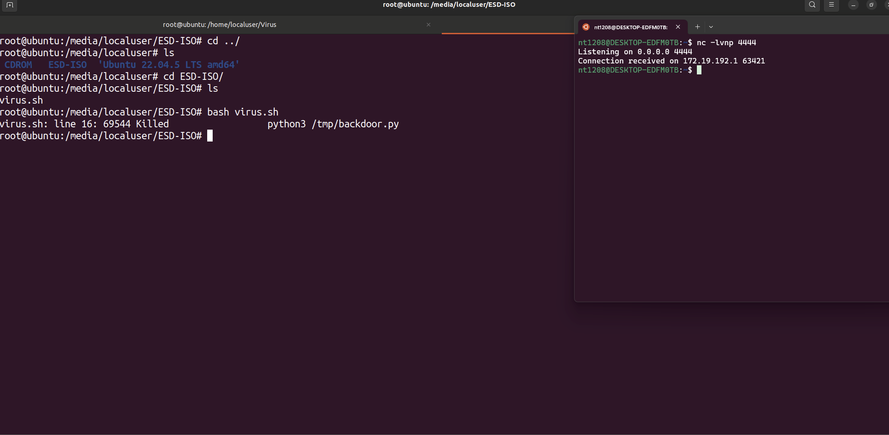
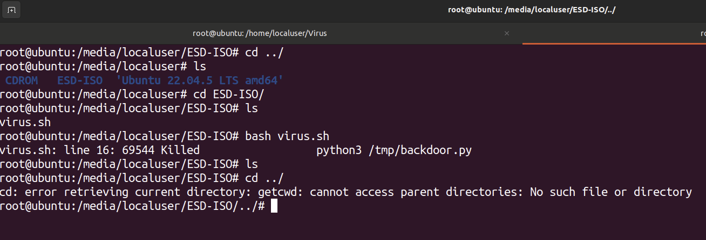
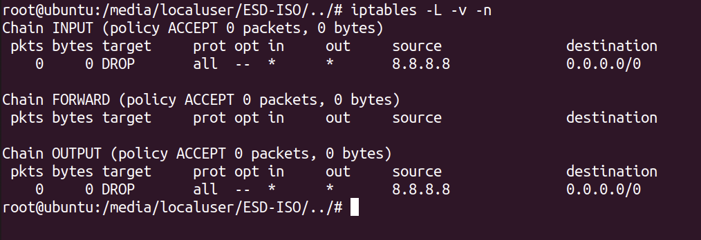

# Scenario 1: Reverse Shell

Execution steps:
• Step 1: Launch a Reverse Shell to connect to the attacker's machine

• Step 2: The lsof-monitor service detects new outbound connections, the Wazuh Agent sends log information back to the Wazuh Manager, then analyzes the logs, compares them with IPs in the blacklist, and generates an alert.

• Step 3: Based on the configuration file, the Wazuh Manager executes appropriate response actions. In this case, the response action will be to disable USB, kill the process, delete the malicious file, and isolate the agent machine from the Internet for deeper investigation.

