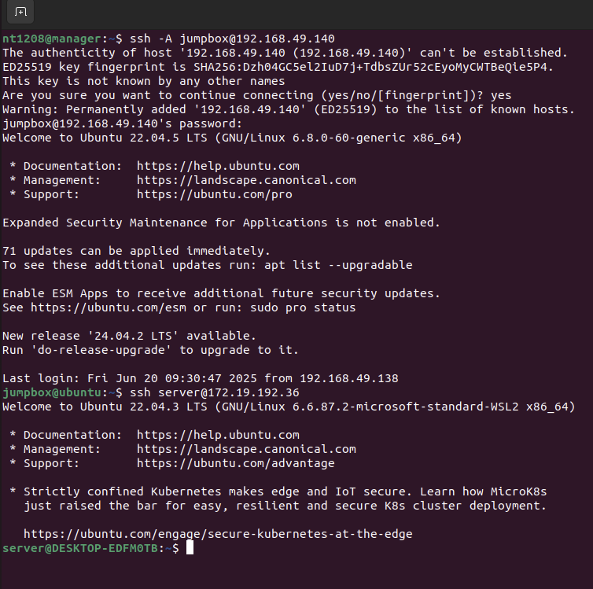
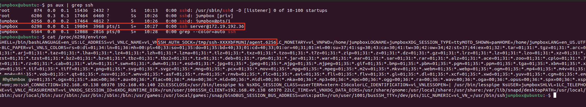
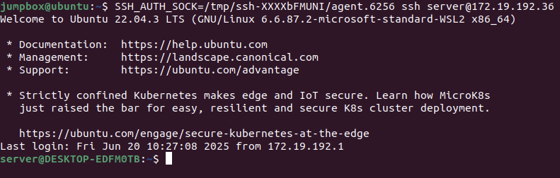
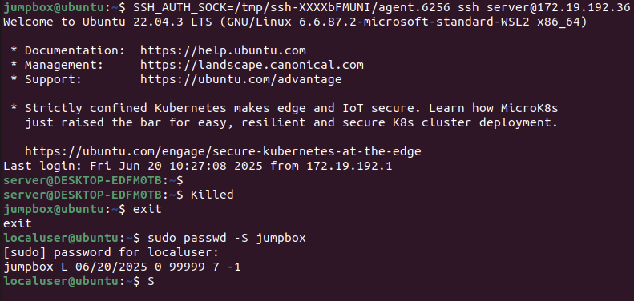

# Scenario 2: SSH Hijacking

Execution steps:
• Step 1: A normal user will establish an SSH connection to the Jump Box, followed by connecting to a machine in the Server Farm zone.

• Step 2: After gaining control of the Jump Box, the attacker will be able to read the SSH_AUTH_SOCK environment variable whenever a user makes an SSH connection to the Server Farm zone.

• Step 3: The attacker uses the read environment variable to hijack the current user's session.

• Step 4: Based on the configuration file, the Wazuh Manager executes appropriate response actions. In this case, the response action will be to disable the jumpbox user and kill the running process of the SSH connection to the Server Farm zone.

