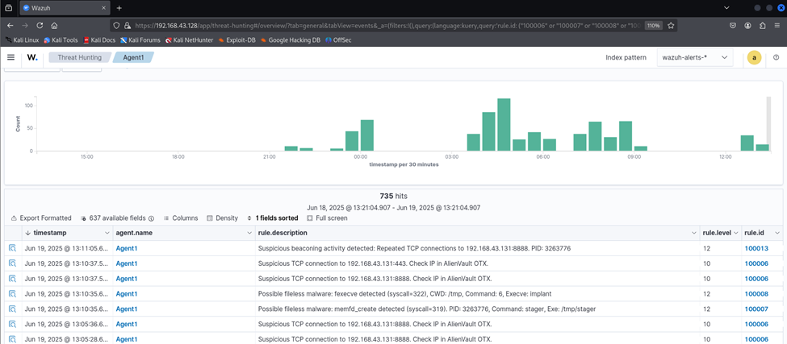
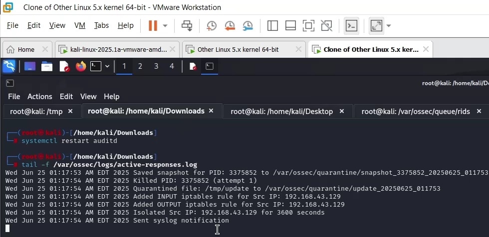
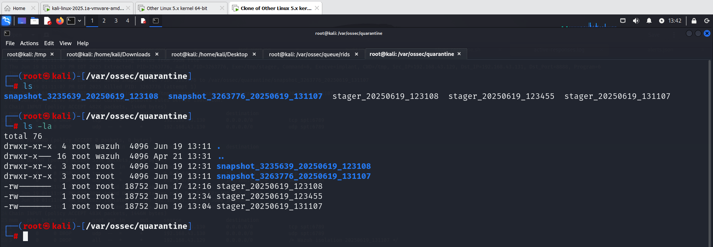
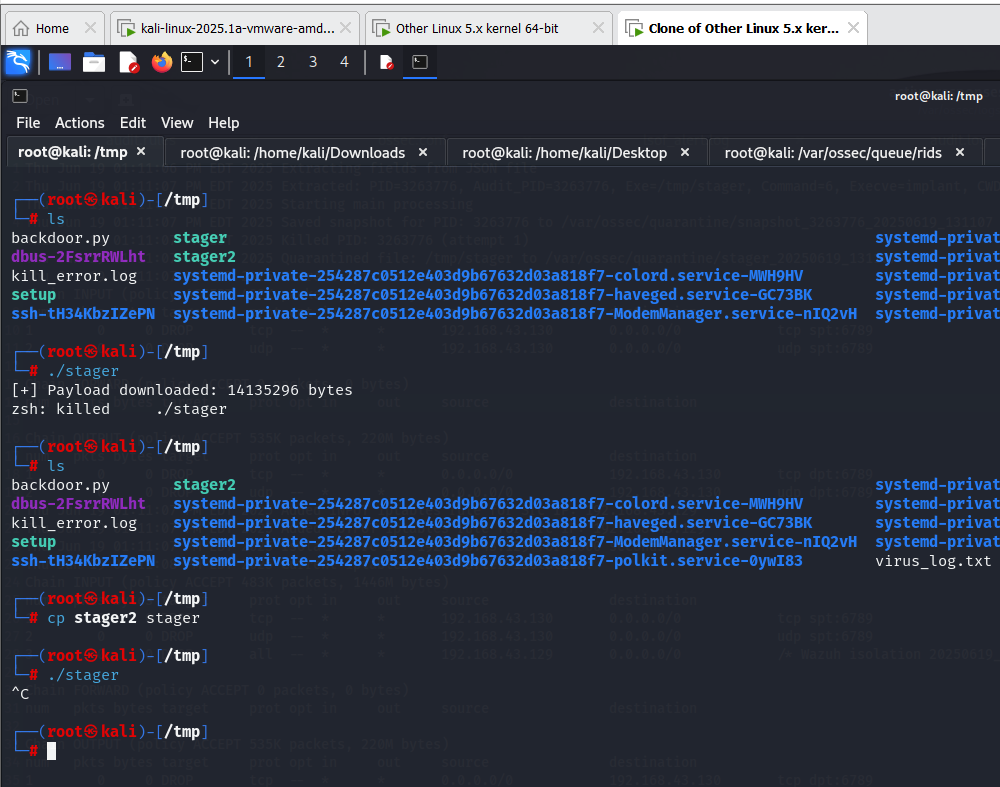

# Scenario 3: Command & Control Server Communication

### Achieved Results:

After the victim launches the malware, Wazuh will detect the alerts and display them on the Dashboard as shown in Figure 4.12.

Regarding Active-Response (Figure 4.13), it reacts to these malicious actions by terminating the process, isolating the malware into the quarantine directory, then blocking inbound and outbound connections of the Linux Endpoint, and finally reporting back (this could be logging or reporting via email/Slack).

As for the malware on the victim's machine, its process has been terminated and it has been isolated into the quarantine directory (Figure 4.14). When conducting a short experiment by copying and re-running the malware file, the text `[+] Payload downloaded: 14135296 bytes` is no longer printed and there is no longer a connection to the C2 server. (Figure 4.15)

